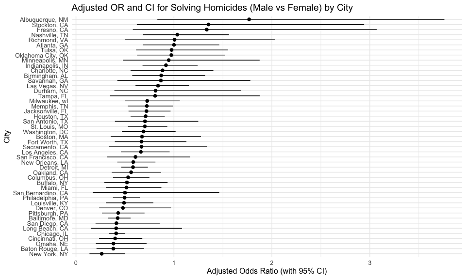
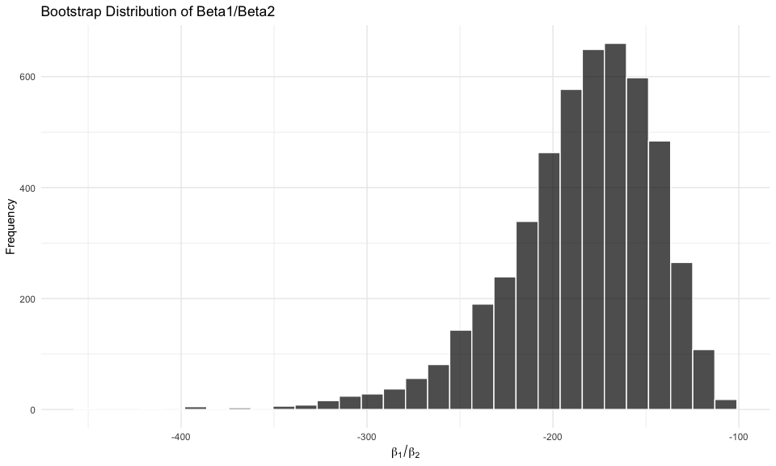
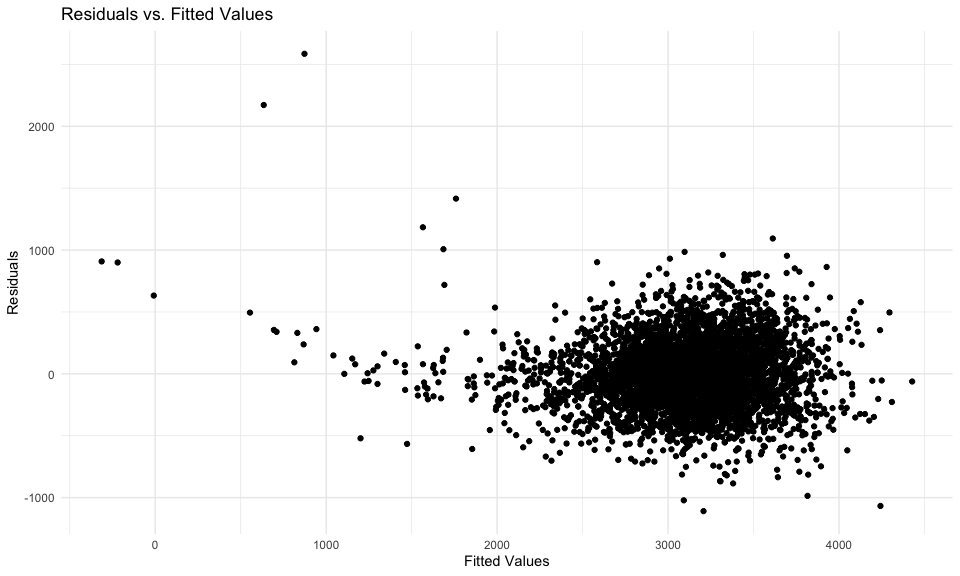

Homework 6
================

``` r
library(tidyverse)
```

    ## ── Attaching core tidyverse packages ──────────────────────── tidyverse 2.0.0 ──
    ## ✔ dplyr     1.1.4     ✔ readr     2.1.5
    ## ✔ forcats   1.0.0     ✔ stringr   1.5.1
    ## ✔ ggplot2   3.5.2     ✔ tibble    3.3.0
    ## ✔ lubridate 1.9.4     ✔ tidyr     1.3.1
    ## ✔ purrr     1.1.0     
    ## ── Conflicts ────────────────────────────────────────── tidyverse_conflicts() ──
    ## ✖ dplyr::filter() masks stats::filter()
    ## ✖ dplyr::lag()    masks stats::lag()
    ## ℹ Use the conflicted package (<http://conflicted.r-lib.org/>) to force all conflicts to become errors

``` r
library(ggplot2)
library(knitr)
library(rvest)
```

    ## 
    ## Attaching package: 'rvest'
    ## 
    ## The following object is masked from 'package:readr':
    ## 
    ##     guess_encoding

``` r
library(modelr)

knitr::opts_chunk$set(
    echo = TRUE,
    warning = FALSE,
  fig.width = 10,
  fig.asp = .6,
  out.width = "90%"
)

theme_set(theme_minimal() + theme(legend.position = "bottom"))

options(
  ggplot2.continuous.colour = "viridis",
  ggplot2.continuous.fill = "viridis"
)

scale_colour_discrete = scale_colour_viridis_d
scale_fill_discrete = scale_fill_viridis_d

set.seed(1)
```

## Problem 1

``` r
library(tidyverse)

homicides_df = read_csv("data/homicide-data.csv") %>% 
  janitor::clean_names() %>% 
  mutate(
    city_state = str_c(city, ", ", state), 
    resolved = if_else(disposition == "Closed by arrest", 1, 0),
    victim_age = as.numeric(victim_age)
  ) %>% 
  filter(
    !city_state %in% c("Dallas, TX", "Phoenix, AZ", "Kansas City, MO", "Tulsa, AL"),
    victim_race %in% c("White", "Black")
  )
```

    ## Rows: 52179 Columns: 12
    ## ── Column specification ────────────────────────────────────────────────────────
    ## Delimiter: ","
    ## chr (9): uid, victim_last, victim_first, victim_race, victim_age, victim_sex...
    ## dbl (3): reported_date, lat, lon
    ## 
    ## ℹ Use `spec()` to retrieve the full column specification for this data.
    ## ℹ Specify the column types or set `show_col_types = FALSE` to quiet this message.

**Baltimore, MD**

``` r
baltimore_glm = 
  homicides_df %>% 
  filter(city_state == "Baltimore, MD") %>% 
  glm(resolved ~ victim_age + victim_sex + victim_race,
      family = binomial(),
      data = .)

baltimore_glm %>% 
  broom::tidy() %>% 
  mutate(
    odds_ratio = exp(estimate),
    ci_upper_odds_ratio = exp(estimate + 1.96 * std.error),
    ci_lower_odds_ratio = exp(estimate - 1.96 * std.error)
  ) %>% 
  filter(term == "victim_sexMale") %>% 
  select(odds_ratio, ci_lower_odds_ratio, ci_upper_odds_ratio) %>%  
  knitr::kable(digits = 3)
```

| odds_ratio | ci_lower_odds_ratio | ci_upper_odds_ratio |
|-----------:|--------------------:|--------------------:|
|      0.426 |               0.325 |               0.558 |

**Linear models for all states**

``` r
cities_glm = 
  homicides_df %>% 
  nest(data = -city_state) %>% 
  mutate(
    models = map(data, ~ glm(
      resolved ~ victim_age + victim_sex + victim_race,
      family = binomial(),
      data = .x
    )),
    tidy_models = map(models, broom::tidy)
  ) %>% 
  unnest(cols = tidy_models) %>% 
  mutate(
    odds_ratio = exp(estimate),
    ci_upper_odds_ratio = exp(estimate + 1.96 * std.error),
    ci_lower_odds_ratio = exp(estimate - 1.96 * std.error)
  ) %>% 
  filter(term == "victim_sexMale") %>% 
  select(city_state, odds_ratio, ci_lower_odds_ratio, ci_upper_odds_ratio)

cities_glm %>% 
  knitr::kable(digits = 3)
```

| city_state         | odds_ratio | ci_lower_odds_ratio | ci_upper_odds_ratio |
|:-------------------|-----------:|--------------------:|--------------------:|
| Albuquerque, NM    |      1.767 |               0.831 |               3.761 |
| Atlanta, GA        |      1.000 |               0.684 |               1.463 |
| Baltimore, MD      |      0.426 |               0.325 |               0.558 |
| Baton Rouge, LA    |      0.381 |               0.209 |               0.695 |
| Birmingham, AL     |      0.870 |               0.574 |               1.318 |
| Boston, MA         |      0.674 |               0.356 |               1.276 |
| Buffalo, NY        |      0.521 |               0.290 |               0.935 |
| Charlotte, NC      |      0.884 |               0.557 |               1.403 |
| Chicago, IL        |      0.410 |               0.336 |               0.501 |
| Cincinnati, OH     |      0.400 |               0.236 |               0.677 |
| Columbus, OH       |      0.532 |               0.378 |               0.750 |
| Denver, CO         |      0.479 |               0.236 |               0.971 |
| Detroit, MI        |      0.582 |               0.462 |               0.734 |
| Durham, NC         |      0.812 |               0.392 |               1.683 |
| Fort Worth, TX     |      0.669 |               0.397 |               1.127 |
| Fresno, CA         |      1.335 |               0.580 |               3.071 |
| Houston, TX        |      0.711 |               0.558 |               0.907 |
| Indianapolis, IN   |      0.919 |               0.679 |               1.242 |
| Jacksonville, FL   |      0.720 |               0.537 |               0.966 |
| Las Vegas, NV      |      0.837 |               0.608 |               1.154 |
| Long Beach, CA     |      0.410 |               0.156 |               1.082 |
| Los Angeles, CA    |      0.662 |               0.458 |               0.956 |
| Louisville, KY     |      0.491 |               0.305 |               0.790 |
| Memphis, TN        |      0.723 |               0.529 |               0.988 |
| Miami, FL          |      0.515 |               0.304 |               0.872 |
| Milwaukee, wI      |      0.727 |               0.499 |               1.060 |
| Minneapolis, MN    |      0.947 |               0.478 |               1.875 |
| Nashville, TN      |      1.034 |               0.685 |               1.562 |
| New Orleans, LA    |      0.585 |               0.422 |               0.811 |
| New York, NY       |      0.262 |               0.138 |               0.499 |
| Oakland, CA        |      0.563 |               0.365 |               0.868 |
| Oklahoma City, OK  |      0.974 |               0.624 |               1.520 |
| Omaha, NE          |      0.382 |               0.203 |               0.721 |
| Philadelphia, PA   |      0.496 |               0.378 |               0.652 |
| Pittsburgh, PA     |      0.431 |               0.265 |               0.700 |
| Richmond, VA       |      1.006 |               0.498 |               2.033 |
| San Antonio, TX    |      0.705 |               0.398 |               1.249 |
| Sacramento, CA     |      0.669 |               0.335 |               1.337 |
| Savannah, GA       |      0.867 |               0.422 |               1.780 |
| San Bernardino, CA |      0.500 |               0.171 |               1.462 |
| San Diego, CA      |      0.413 |               0.200 |               0.855 |
| San Francisco, CA  |      0.608 |               0.317 |               1.165 |
| St. Louis, MO      |      0.703 |               0.530 |               0.932 |
| Stockton, CA       |      1.352 |               0.621 |               2.942 |
| Tampa, FL          |      0.808 |               0.348 |               1.876 |
| Tulsa, OK          |      0.976 |               0.614 |               1.552 |
| Washington, DC     |      0.690 |               0.468 |               1.017 |

**All Cities OR and CI Plot**

``` r
cities_glm %>% 
  mutate(city_state = fct_reorder(city_state, odds_ratio)) %>% 
  ggplot(aes(x = city_state, y = odds_ratio)) +
  geom_point(size = 2) +
  geom_errorbar(
    aes(ymin = ci_lower_odds_ratio, ymax = ci_upper_odds_ratio),
    width = 0
  ) +
  coord_flip() +
  labs(
    title = "Adjusted OR and CI for Solving Homicides (Male vs Female) by City",
    x = "City",
    y = "Adjusted Odds Ratio (with 95% CI)"
  ) +
  theme_minimal(base_size = 12) 
```


The plot shows how adjusted odds ratios vary across the different
cities. Most cities have an OR which is close to 1, indicating little
differentiation in solve rates between male and female victims. However,
because the confidence intervals cross 1, uncertainty is wide in many of
the cities. This also indicates that difference may not be statistically
significant. Specifically, Albuquerque, NM has the highest point
estimates and CI is very wide. Overall, male victim homicides are more
likely to be solved than female-victim homicides if OR is above 1 (in
most).Places like Baltimore and Baron Rouge are opposite with OR below 1
meaning the opposite: female victims have slightly higher clearance in
these areas.

## Problem 2

``` r
library(p8105.datasets)
data("weather_df")

weather_df =
  weather_df %>%
  mutate(
    tmin = tmin / 10,
    tmax = tmax / 10,
    prcp = prcp / 10
  ) %>%
  drop_na(tmin, tmax, prcp) %>%
  arrange(date)
```

Bootstrapping

``` r
boot_rsq = function(fit) {
  fit %>% 
    broom::glance() %>% 
    pull(r.squared)
}

boot_beta = function(fit) {
  coefs = broom::tidy(fit)
  beta1 = coefs %>%  
    filter(term == "tmin") %>%  
    pull(estimate)
  beta2 = coefs %>%  
    filter(term == "prcp") %>% 
    pull(estimate)
  beta1 / beta2
}
```

5000 samples and estimates of 𝑟̂2 and𝛽̂ 1/𝛽̂ 2

``` r
bootstrap_results =
  weather_df %>% 
  bootstrap(5000) %>% 
  mutate(
    models = map(strap, \(x) lm(tmax ~ tmin + prcp, data = x)),
    r2 = map_dbl(models, boot_rsq),
    beta1_beta2 = map_dbl(models, boot_beta)
  ) %>% 
  select(r2, beta1_beta2)
```

Distribution of estimates for Beta

``` r
ggplot(bootstrap_results, aes(x = beta1_beta2)) +
  geom_histogram(bins = 30, fill = "black", alpha = 0.7, color = "white") +
  labs(
    title = "Bootstrap Distribution of Beta1/Beta2",
    x = expression(beta[1] / beta[2]),
    y = "Frequency"
  )
```



The distribution of beta1/beta2 ratio is left-skewed with a wider range.
There is much more variation here than R^2. The beta2 value is typically
smaller because we are looking at effect of precipitation on tmax.
Dividing by smaller number leaves results in large negative values as
final answer, illustrated by the center of the distribution. The
distribution is highly variable and unstable compared to R^2.

Distribution of estimates for R2

``` r
ggplot(bootstrap_results, aes(x = r2)) +
  geom_histogram(bins = 30, fill = "black", color = "white") +
  labs(title = "Bootstrap Distribution of R²",
       x = "R²",
       y = "Frequency")
```


The distribution for R^2 is approximately symmetric and seems normal. It
seems to be centered around 0.942 and has a tight fit. This may indicate
that overall model fit is highly stable across the bootstrap samples.

Identify the 2.5% and 97.5% quantiles

``` r
bootstrap_quantile =
bootstrap_results %>% 
  summarize(
    r2_low = quantile(r2, 0.025),
    r2_high = quantile(r2, 0.975),
    beta_low = quantile(beta1_beta2, 0.025),
    beta_high = quantile(beta1_beta2, 0.975)
  )

knitr::kable(bootstrap_quantile, digits = 3)
```

| r2_low | r2_high | beta_low | beta_high |
|-------:|--------:|---------:|----------:|
|  0.934 |   0.947 | -281.913 |  -124.645 |

## Problem 3

``` r
birthweight_df = read_csv("data/birthweight.csv") %>% 
  janitor::clean_names() %>%                                   
  mutate(
    babysex = as.factor(babysex),                               
    frace = as.factor(frace),                                  
    malform = as.factor(malform),                               
    mrace = as.factor(mrace)                                    
  )
```

    ## Rows: 4342 Columns: 20
    ## ── Column specification ────────────────────────────────────────────────────────
    ## Delimiter: ","
    ## dbl (20): babysex, bhead, blength, bwt, delwt, fincome, frace, gaweeks, malf...
    ## 
    ## ℹ Use `spec()` to retrieve the full column specification for this data.
    ## ℹ Specify the column types or set `show_col_types = FALSE` to quiet this message.

``` r
sum(is.na(birthweight_df))                                  
```

    ## [1] 0

Regression Model for Birthweight

``` r
birth_model =
  birthweight_df %>% 
  lm(bwt ~ bhead + blength + gaweeks + babysex + smoken + wtgain, data = .)
```

For the regression model that I created for birthweight, I focused
mainly on biological reasoning/factors. Things that would directly
influence birthweight such as head circumference, birth length, etc. I
also added gestational age because infants typically born after more
weeks weigh more. Lastly, I also incorporated maternal and demographic
factors like baby sex and smoking during pregnancy because those do play
a factor usually in weight. Specifically, smoking may result in reduced
growth. All these variables are predictors with biological reasoning
while trying to keep it as simple as I can.

**Residuals vs Fitted Values Plot**

``` r
birthweight_df %>% 
  modelr::add_predictions(birth_model) %>% 
  modelr::add_residuals(birth_model) %>%  
  ggplot(aes(x = pred, y = resid)) + 
  geom_point() + 
  labs(title = "Residuals vs. Fitted Values",
       x = "Fitted Values",
       y = "Residuals") 
```



**Compare your model to two others**

``` r
birth_model_2 = 
  lm(bwt ~ blength + gaweeks,
     data = birthweight_df)

birth_model_3 = 
  lm(bwt ~ bhead * blength * babysex,
     data = birthweight_df) 

set.seed(123)

cv_df =
  crossv_mc(birthweight_df, n = 100) %>% 
  mutate(
    train = map(train, as_tibble),
    test = map(test, as_tibble)) %>% 
  mutate(
   mod_mod = map(train, ~ lm(bwt ~ bhead + blength + gaweeks + babysex + smoken +    wtgain, data = .x)),
    comp2_mod = map(train, ~lm(bwt ~ gaweeks + blength, data = .x)),
    comp3_mod = map(train, ~lm(bwt ~ bhead + blength + babysex + bhead * blength + bhead * babysex + blength * babysex + bhead * blength * babysex, data = .x))
  ) %>% 
  mutate(
    rmse_mod_mod = map2_dbl(mod_mod, test, ~rmse(model = .x, data = .y)),
    rmse_comp2_mod = map2_dbl(comp2_mod, test, ~rmse(model = .x, data = .y)),
    rmse_comp3_mod = map2_dbl(comp3_mod, test, ~rmse(model = .x, data = .y))
  )

cv_df %>%  
  summarise(mod1_mean_error = mean(rmse_mod_mod),
            mod2_mean_error = mean(rmse_comp2_mod),
            mod3_mean_error = mean(rmse_comp3_mod)) %>% 
  knitr::kable(digits = 3)
```

| mod1_mean_error | mod2_mean_error | mod3_mean_error |
|----------------:|----------------:|----------------:|
|         283.347 |         330.709 |         288.385 |

Comparing the three models, model 1 shows the lowest RMSE, indicating
the most accurate prediction for birthweight. The second model which
includes length at birth and gestational age as predictors had the
highest RMSE. Because it is a simpler model, might be the least accurate
and reliable for birthweight. Lastly, model 3 which included head
circumference, length, sex, and all interactions between these, had RMSE
between the two other models. Despite the interaction, it didn’t improve
accuracy. From this, overall model 1 has the best balance of accuracy
compared to the more complex and simple model.
